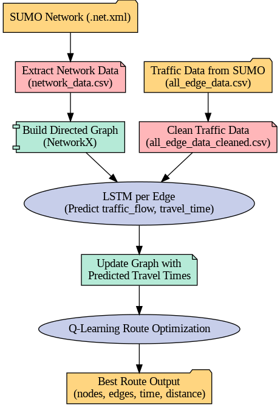

# 🚑 Emergency Vehicle Routing Using SUMO + LSTM + Q-Learning

## 📌 Overview

This project simulates **emergency vehicle routing** in an urban environment using the **SUMO** (Simulation of Urban MObility) traffic simulator, **LSTM neural networks** for traffic prediction, and **Q-learning** for route optimization.

The goal is to:

1. Predict **future traffic conditions** for each road segment.
2. Compute **optimal emergency vehicle routes** that minimize travel time.
3. Use **real-time and historical traffic data** to make routing decisions dynamically.

---

## 📂 Project Workflow



### **Step-by-Step Process**

1. **Extract road network** from SUMO `.net.xml` file → Save to `network_data.csv`.
2. **Collect traffic data** from SUMO simulation → Save to `all_edge_data.csv`.
3. **Clean traffic data** → Remove invalid/zero-traffic/internal edges → Save to `all_edge_data_cleaned.csv`.
4. **Build road network graph** in NetworkX with distances and travel times.
5. **Train LSTM per edge** to predict next time step's traffic flow & travel time.
6. **Update graph** with predicted travel times.
7. **Run Q-learning** to find the fastest route.
8. **Output best route** (nodes, edges, predicted travel time, distance).

---

## 🔧 Dependencies

Make sure to install the following:

```bash
# Install SUMO
apt-get install sumo sumo-tools sumo-doc

# Install Python packages
pip install traci numpy torch matplotlib pandas networkx scikit-learn tensorflow tqdm
```

---

## 📊 Input & Output Files

### **Inputs**

* `updated.net.xml` → SUMO network file.
* `all_edge_data.csv` → Traffic data extracted from SUMO simulation.

### **Outputs**

* `network_data.csv` → Static network structure.
* `all_edge_data_cleaned.csv` → Cleaned traffic dataset.
* **Predicted optimal route** with:

  * Sequence of nodes
  * Sequence of edges
  * Total predicted travel time
  * Total distance

---

## 🧠 Tech Stack

* **Traffic Simulation** → SUMO, TraCI, sumolib
* **Data Processing** → Pandas, NumPy
* **Graph Representation** → NetworkX
* **Traffic Prediction** → LSTM (TensorFlow/Keras)
* **Route Optimization** → Q-learning (custom implementation)
* **Visualization & Debugging** → Matplotlib, tqdm

---

## 🚀 How to Run

1. **Prepare the SUMO Network**

   * Export `.net.xml` from SUMO or OpenStreetMap.
   * Run the data extraction cell to generate `network_data.csv`.

2. **Collect Traffic Data**

   * Run SUMO simulation with your scenario.
   * Save real-time traffic logs to `all_edge_data.csv`.

3. **Clean Data**

   * Execute the cleaning script to create `all_edge_data_cleaned.csv`.

4. **Train LSTM Models**

   * The notebook will train **one LSTM per edge**.
   * Store predictions in dictionaries for travel time updates.

5. **Run Q-Learning**

   * Train the RL agent with updated travel times.
   * Use `find_best_path_rl()` to get the best route.

---

## 📈 Example Output

```
🧭 Best path (nodes): J1 -> J5 -> J8 -> J10
🛣️ Best path (edges): E1 -> E7 -> E9
⏱️ Total predicted time: 320.45 seconds
📏 Total distance: 2450.00 meters
```

---

## 🔮 Future Improvements

* Integrate **real-time traffic feeds** for dynamic re-routing.
* Use **multi-agent RL** to simulate multiple emergency vehicles.
* Add **traffic light control** for emergency prioritization.
* Visualize routes in SUMO GUI.

---

